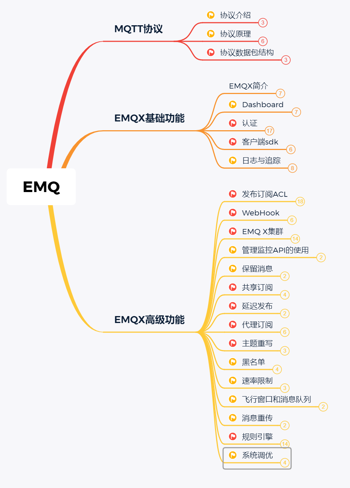
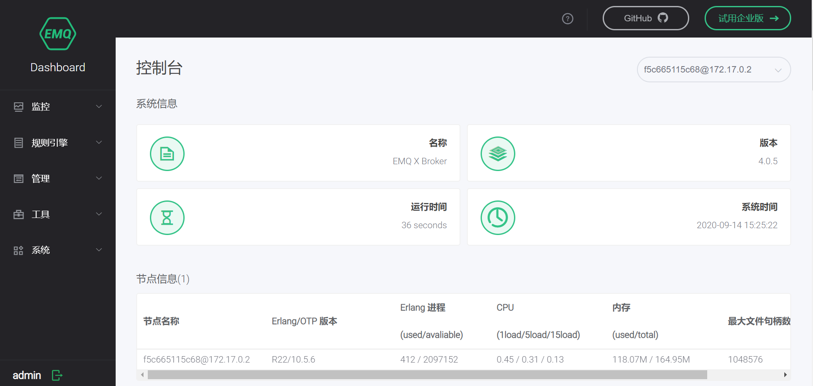

# 物联网消息引擎：EMQ X 

## 课程背景

**1、5G 时代，万物互联**

随着5G的到来，万物互联已经成为现实，物联网行业得以蓬勃发展，催生了很多的应用，比如：物联网pass平台，车联网，面向云平台的IOT-Hub，NB-IoT蜂窝网络，新零售等等，而开发这些应用的核心要素就是物联网设备和平台之间的数据交换，并且要兼备高并发低时延，支持分布式集群等特点，因此打造一款助力构建 5G 时代物联网平台与应用的消息引擎显得尤为重要，而EMQ X则是首选方案。

**2、真实的企业需求**

一大批先行企业抓住了这个行业风口想做出很好的产品，因此也需要大批的技术人员来帮助他们实现，其中不乏有很多底蕴丰厚，前景广阔的平台。

**3、开发人员现状**

市场中具备相应能力的开发人员不多，因此需要一门课程帮助他们来提高。

## 课程概述

本课程从物联网消息通信协议MQTT出发，从协议的原理，数据包的结构，到遵循该协议的消息引擎EMQX，完整的讲授了EMQX Broker消息处理服务器的基础功能及高级功能的使用，帮助学员快速掌握物联网消息引擎EMQX

## 课程特色

为什么推荐大家学习这们课？

1：开源社区最受欢迎的物联网消息引擎，5G 时代大型物联网应用首选技术方案

2：EMQX 助力构建 5G 时代物联网平台与应用；海量物联网设备一站式连接；高并发低时延，大规模分布式，高可用集群架构；强大规则引擎，快速应用集成；边缘到云端，云端到跨云部署

3：完整 MQTT 协议支持，完全开放源码

## 课程内容

本课程的目标是：

1：理解MQTT协议的设计原理和具体的数据结构

2：能够独立使用EMQX 消息服务器的基础功能和高级功能

课程大纲如下：

EMQX Broker中的Dashboard页面展示如下：

## 学习收获

学习完本课程我们能具备以下能力：

1：能够掌握MQTT这种基于发布/订阅模式的物联网消息通信协议，理解其原理和实现方式，对协议的数据格式非常清楚，能有效应对面试及工作

2：能够搭建EMQX Broker消息服务器环境，掌握它的基本使用步骤。

3：能够使用EMQX Broker轻松连接物联网设备，完成设备端的身份认证和数据双向通信。

4：能够掌握EMQX Broker消息发布/订阅的ACL权限控制，WebHook网络钩子，集群的搭建和使用。

5：能够掌握EMQX Broker中的保留消息，共享订阅，延迟发布，代理订阅，主题重写，黑名单，速率限制，规则引擎等功能。

## 适用人群

目标人群：

1：想要从事物联网行业的技术人员

2：想要完善物联网技术体系的IT人员

3：毕业想从事java开发工作且跟物联网相关的大学生

知识储备：

1：具备一定的Java基础

2：具备基本的springboot使用能力

3：了解计算机网络的基础知识

## 环境和软件版本

1：java：8

2：EMQX Broker 4.5

3：docker/linux-centos7

4：IDEA2017以上版本

5：maven3.5.x以上版本

6：MQTTX客户端

7：Visual Studio code

## 学习方法及建议

1：多动手，课前预习，课后复习，代码一定要手动敲，避免CV,主动记笔记

2：多动眼，除了要仔细看课程提供的讲义外，还要主动阅读相关技术的操作文档

3：多动口，对于课程中不懂的知识点要主动咨询，多和同学/同事交流学习的心得

4：多动脑，对于一些技术点要主动的思考其底层的原理，要知其然还要知其所以然

<link href="https://cdn.bootcdn.net/ajax/libs/gitalk/1.7.2/gitalk.min.css" rel="stylesheet">

