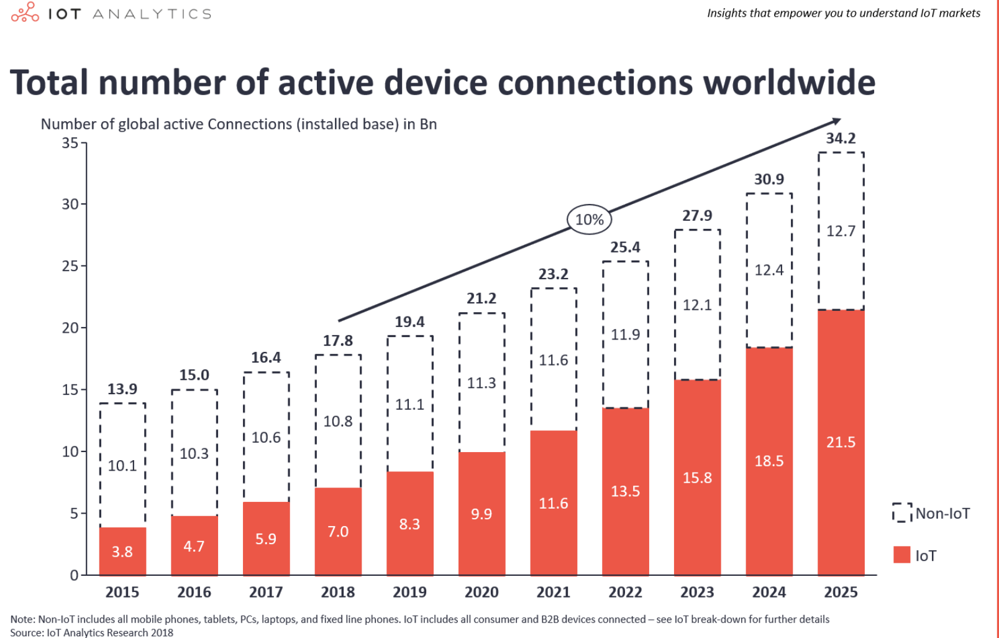
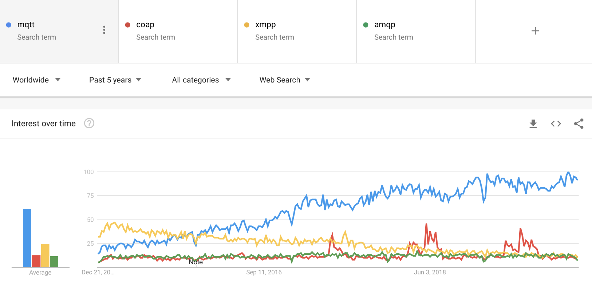
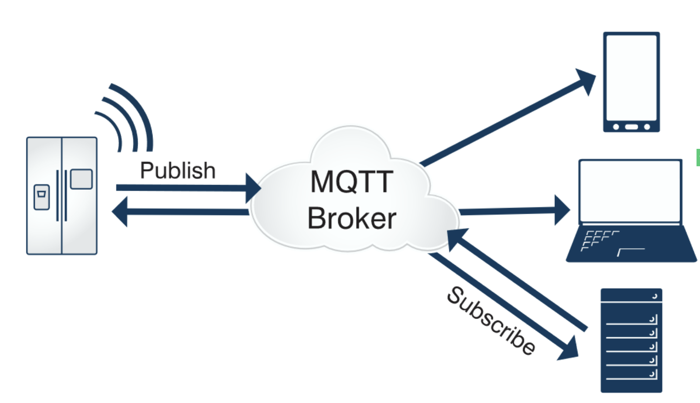
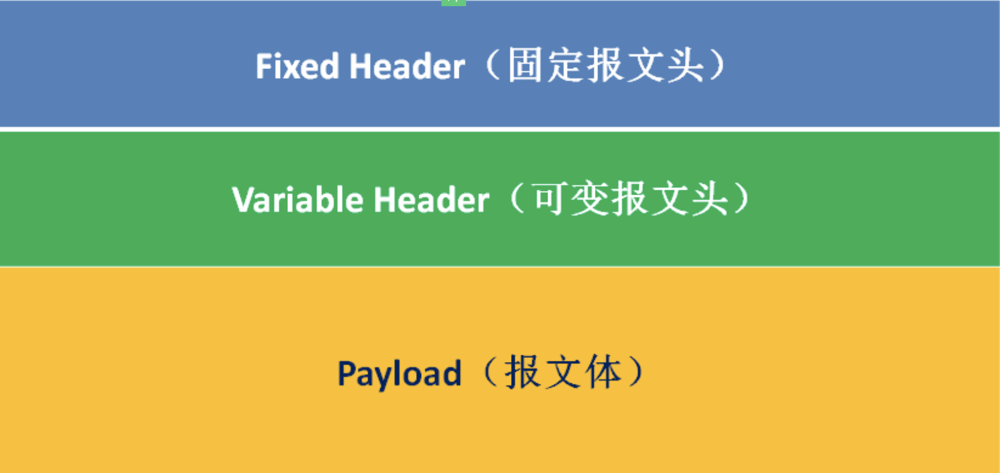

# MQTT协议
## 背景
> 随着 5G 时代的来临，万物物联的伟大构想正在成为现实。联网的物联网设备在 2018 年已经达到了 70 亿，在未来两年，仅智能水电气表就将超过10亿


> 海量的设备接入和设备管理对网络带宽、通信协议以及平台服务架构都带来了很大挑战。
> 对于物联网协议来说，必须针对性地解决物联网设备通信的几个关键问题：
>   其网络环境复杂而不可靠、
>   其内存和闪存容量小、
>   其处理器能力有限。

> MQTT 是基于 Publish/Subscribe 模式的物联网通信协议，凭借简单易实现、支持 QoS、报文小等特点，占据了物联网协议的半壁江山：


## MQTT协议介绍
> [mqtt官网](https://mqtt.org/)  
> [mqtt中文网](http://mqtt.p2hp.com/)  
> MQTT（Message Queuing Telemetry Transport，消息队列遥测传输协议），  
> 是一种基于发布/订阅（publish/subscribe）模式的"轻量级"通讯协议，该协议构建于TCP/IP协议上，  
> 由IBM在1999年发布。  
> MQTT最大优点在于，可以以极少的代码和有限的带宽，为连接远程设备提供实时可靠的消息服务。  
> 作为一种低开销、低带宽占用的即时通讯协议，使其在物联网、小型设备、移动应用等方面有较广泛的应用。  

> MQTT是一个基于客户端-服务器的消息发布/订阅传输协议。  
> MQTT协议是轻量、简单、开放和易于实现的，这些特点使它适用范围非常广泛。  
> 在很多情况下，包括受限的环境中，如：机器与机器（M2M）通信和物联网（IoT）。其在，通过卫星链路通信传感器、偶尔拨号的医疗设备、智能家居、及一些小型化设备中已广泛使用。


### MQTT协议设计规范
```
（1）精简，不添加可有可无的功能；
（2）发布/订阅（Pub/Sub）模式，方便消息在传感器之间传递，解耦Client/Server模式，带来的好处在于不必预先知道对方的存在（ip/port），不必同时运行；
    消息中间件模式
（3）允许用户动态创建主题（不需要预先创建主题），零运维成本；
（4）把传输量降到最低以提高传输效率；
（5）把低带宽、高延迟、不稳定的网络等因素考虑在内；
（6）支持连续的会话保持和控制（心跳）；
（7）理解客户端计算能力可能很低；
（8）提供服务质量（quality of service level：QoS）管理；
（9）不强求传输数据的类型与格式，保持灵活性（指的是应用层业务数据）。
```
### MQTT协议主要特性
> MQTT协议工作在低带宽、不可靠的网络的远程传感器和控制设备通讯而设计的协议，它具有以下主要的几项特性：
```
（1）开放消息协议，简单易实现。
（2）使用发布/订阅消息模式，提供一对多的消息发布，解除应用程序耦合。
（3）对负载（协议携带的应用数据）内容屏蔽的消息传输。
（4）基于TCP/IP网络连接,提供有序，无损，双向连接。
        主流的MQTT是基于TCP连接进行数据推送的，
        但是同样有基于UDP的版本，叫做MQTT-SN。
        这两种版本由于基于不同的连接方式，优缺点自然也就各有不同了。
（5）消息服务质量（QoS）支持，可靠传输保证；有三种消息发布服务质量：
        QoS0："至多一次"，消息发布完全依赖底层TCP/IP网络。
                会发生消息丢失或重复。这一级别可用于如下情况，环境传感器数据，丢失一次读记录无所谓，因为不久后还会有第二次发送。这一种方式主要普通APP的推送，倘若你的智能设备在消息推送时未联网，推送过去没收到，再次联网也就收不到了。
        QoS1："至少一次"，确保消息到达，但消息重复可能会发生。
        QoS2："只有一次"，确保消息到达一次。在一些要求比较严格的计费系统中，可以使用此级别。
                在计费系统中，消息重复或丢失会导致不正确的结果。这种最高质量的消息发布服务还可以用于即时通讯类的APP的推送，确保用户收到且只会收到一次。
（6）1字节固定报头，2字节心跳报文，最小化传输开销和协议交换，有效减少网络流量。
    这就是为什么在介绍里说它非常适合"在物联网领域，传感器与服务器的通信，信息的收集，要知道嵌入式设备的运算能力和带宽都相对薄弱，使用这种协议来传递消息再适合不过了。
（7）在线状态感知：使用Last Will和Testament特性通知有关各方客户端异常中断的机制。
        Last Will：即遗言机制，用于通知同一主题下的其他设备，发送遗言的设备已经断开了连接。
        Testament：遗嘱机制，功能类似于Last Will。
```

### MQTT协议应用领域
> MQTT协议广泛应用于物联网、移动互联网、智能硬件、车联网、电力能源等领域。
```
物联网M2M通信，物联网大数据采集
Android消息推送，WEB消息推送
移动即时消息，例如Facebook Messenger
智能硬件、智能家具、智能电器
车联网通信，电动车站桩采集
智慧城市、远程医疗、远程教育
电力、石油与能源等行业市场
```

## MQTT协议原理
### MQTT协议实现方式
> 实现MQTT协议需要客户端和服务器端通讯完成，  
> 在通讯过程中，MQTT协议中有三种身份：  
> 发布者（Publish）、代理（Broker）（服务器）、订阅者（Subscribe）。  
> 其中，消息的发布者和订阅者都是客户端，消息代理是服务器，消息发布者可以同时是订阅者。  
> MQTT传输的消息分为：主题（Topic）和负载（payload）两部分：  
> （1）Topic，可以理解为消息的类型，订阅者订阅（Subscribe）后，就会收到该主题的消息内容（payload）；  
> （2）payload，可以理解为消息的内容，是指订阅者具体要使用的内容。  

### 网络传输与应用消息
> MQTT会构建底层网络传输：它将建立客户端到服务器的连接，提供两者之间的一个有序的、无损的、基于字节流的双向传输。  
> 当应用数据通过MQTT网络发送时，MQTT会把与之相关的服务质量（QoS）和主题名（Topic）相关连。

### MQTT客户端
> 一个使用MQTT协议的应用程序或者设备，它总是建立到服务器的网络连接。客户端可以：
```
（1）发布其他客户端可能会订阅的信息；
（2）订阅其它客户端发布的消息；
（3）退订或删除应用程序的消息；
（4）断开与服务器连接。
```

### MQTT服务器端
> MQTT服务器以称为"消息代理"（Broker），可以是一个应用程序或一台设备。它是位于消息发布者和订阅者之间，它可以：
```
（1）接受来自客户的网络连接；
（2）接受客户发布的应用信息；
（3）处理来自客户端的订阅和退订请求；
（4）向订阅的客户转发应用程序消息。
```

### 发布/订阅、主题、会话
#### 发布/订阅
> MQTT 是基于发布(Publish)/订阅(Subscribe)模式来进行通信及数据交换的，与 HTTP 的请求(Request)/应答(Response)的模式有本质的不同。  
> 订阅者(Subscriber)会向消息服务器(Broker)订阅一个主题(Topic)。成功订阅后，消息服务器会将该主题下的消息转发给所有的订阅者。  
> 主题(Topic)以 ‘/’ 为分隔符区分不同的层级。  
>   包含通配符 ‘+’ 或 ‘#’ 的主题又称为主题过滤器(Topic Filters);   
>   不含通配符的称为主题名(Topic Names)  
```
'+':表示通配一个层级，
    例如a/+，匹配a/x,a/y
'#':表示通配多个层级，
    例如a/#，匹配a/x,a/b/c/d
注:‘+’通配一个层级，’#’通配多个层级(必须在末尾)。
```
> 例如:
```
chat/room/1
sensor/10/temperature
sensor/+/temperature
$SYS/broker/metrics/packets/received
$SYS/broker/metrics/#
```
> 发布者(Publisher) 只能向 ‘主题名’ 发布消息，订阅者(Subscriber) 则可以通过订阅 ‘主题过滤器’ 来通配多个主题名称。

#### 会话（Session）
> 每个客户端与服务器建立连接后就是一个会话，客户端和服务器之间有状态交互。会话存在于一个网络之间，也可能在客户端和服务器之间跨越多个连续的网络连接。

### MQTT协议中的方法
> MQTT协议中定义了一些方法（也被称为动作），来于表示对确定资源所进行操作。这个资源可以代表预先存在的数据或动态生成数据，这取决于服务器的实现。通常来说，资源指服务器上的文件或输出。主要方法有：
```
（1）CONNECT：客户端连接到服务器
（2）CONNACK：连接确认
（3）PUBLISH：发布消息
（4）PUBACK：发布确认
（5）PUBREC：发布的消息已接收
（6）PUBREL：发布的消息已释放
（7）PUBCOMP：发布完成
（8）SUBSCRIBE：订阅请求
（9）SUBACK：订阅确认
（10）UNSUBSCRIBE：取消订阅
（11）UNSUBACK：取消订阅确认
（12）PINGREQ：客户端发送心跳
（13）PINGRESP：服务端心跳响应
（14）DISCONNECT：断开连接
（15）AUTH：认证
```

## MQTT协议数据包结构
> 官方文档中对于MQTT协议包的结构有着具体的说明: [地址](http://mqtt.p2hp.com/mqtt-5-0)
> 在MQTT协议中，一个MQTT数据包由：
>   固定头（Fixed header）、可变头（Variable header）、消息体（payload）三部分构成。
> MQTT数据包结构如下：

```
（1）固定头（Fixed header）。存在于所有MQTT数据包中，表示数据包类型及数据包的分组类标识，如连接，发布，订阅，心跳等。其中固定头是必须的，所有类型的MQTT协议中，都必须包含固定头。
（2）可变头（Variable header）。存在于部分MQTT数据包中，数据包类型决定了可变头是否存在及其具体内容。可变头部不是可选的意思，而是指这部分在有些协议类型中存在，在有些协议中不存在。
（3）消息体（Payload）。存在于部分MQTT数据包中，表示客户端收到的具体内容。与可变头一样，在有些协议类型中有消息内容，有些协议类型中没有消息内容。
```

### 固定头（Fixed header）

> 固定头存在于所有MQTT数据包中，固定头包含两部分内容，首字节(字节1)和剩余消息报文长度(从第二个字节开始，长度为1-4字节)，剩余长度是当前包中剩余内容长度的字节数，包括变量头和有效负载中的数据）。剩余长度不包含用来编码剩余长度的字节。  
> 剩余长度使用了一种可变长度的结构来编码，这种结构使用单一字节表示0-127的值。大于127的值如下处理。每个字节的低7位用来编码数据，最高位用来表示是否还有后续字节。因此每个字节可以编码128个值，再加上一个标识位。剩余长度最多可以用四个字节来表示。

### 可变头(Variable Header)
### 消息体(Payload)
<script src="https://cdn.bootcss.com/blueimp-md5/2.12.0/js/md5.min.js"></script>
<link href="https://cdn.bootcdn.net/ajax/libs/gitalk/1.7.2/gitalk.min.css" rel="stylesheet">
<script src="https://cdn.bootcdn.net/ajax/libs/gitalk/1.7.2/gitalk.min.js"></script>
<div id="gitalk-container"></div>
<script>
    var gitalk = new Gitalk({
    clientID: '4c2fa3d62f2b207e2da4',
    clientSecret: 'cfeb64e9a617ab3957598b3d1e501f7b9002aca7',
    repo: 'gitbook-commit',
    owner: 'runing-time',
    admin: ['runing-time'],
    id: md5(location.pathname),
    });
    gitalk.render('gitalk-container');
 </script>